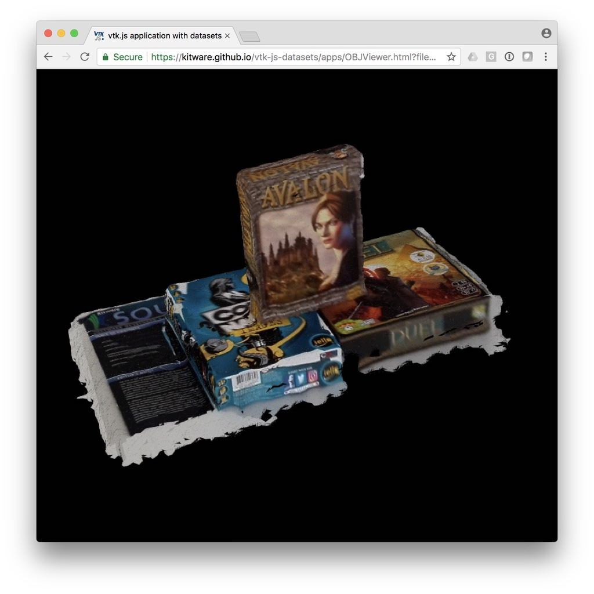

title: TeleSculptor - Smartphone data
---

This dataset was generated from a smartphone video using [MAP-Tk TeleSculptor](https://github.com/kitware/maptk).
The algorithms used to extract 3D from video can be found in [KWIVER](http://www.kwiver.org/).

__Data Size:__ [3.3 MB](/vtk-js-datasets/data/obj-mtl/board_games.obz)
