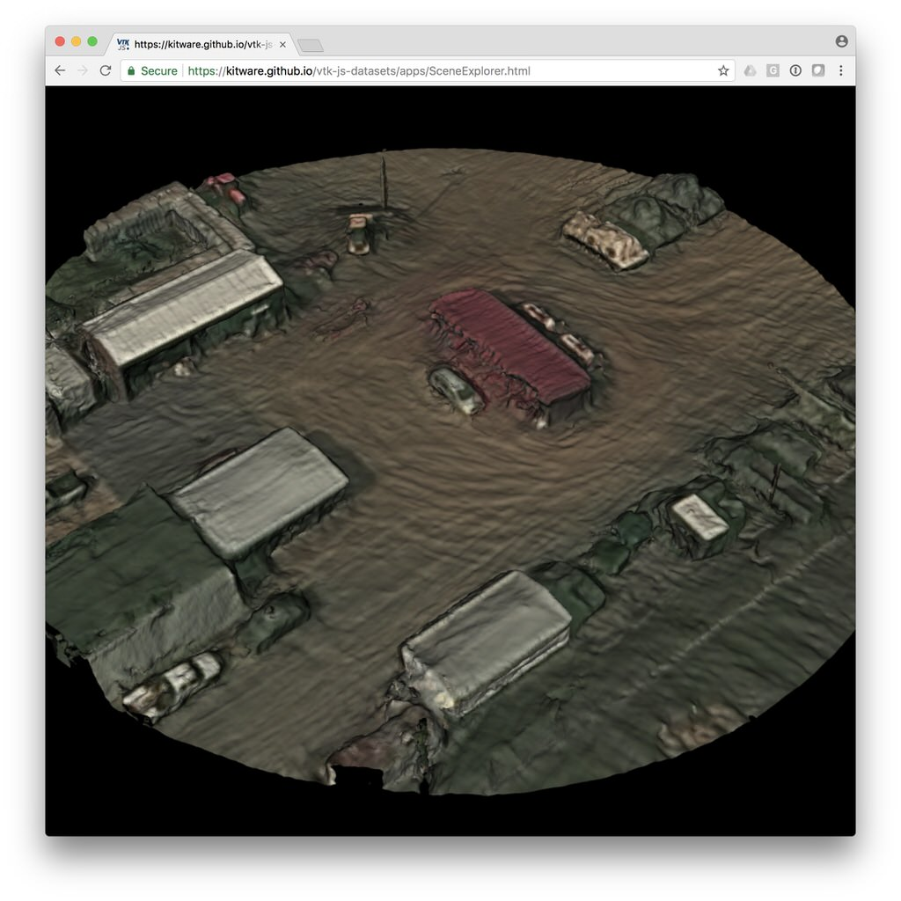

title: TeleSculptor Mesh - VIRAT Public DataSet, Fort A.P. Hill
---

This dataset was generated from [VIRAT](http://www.viratdata.org/) aerial video using [MAP-Tk TeleSculptor](https://github.com/kitware/maptk).
The algorithms used to extract 3D from video can be found in [KWIVER](http://www.kwiver.org/).

__Data Size:__ [8.8 MB](/vtk-js-datasets/data/vtkjs/TeleSculptor-APHill.vtkjs)
