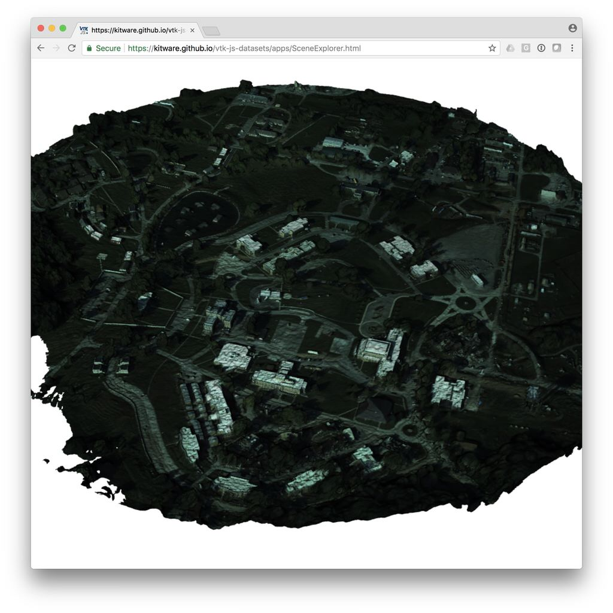

title: TeleSculptor Mesh - AFRL SUSSEX, MUTC
---

This dataset was generated from [AFRL](https://www.sdms.afrl.af.mil/) aerial video using [MAP-Tk TeleSculptor](https://github.com/kitware/maptk).
The algorithms used to extract 3D from video can be found in [KWIVER](http://www.kwiver.org/).

__Data Size:__ [22.7 MB](/vtk-js-datasets/data/vtkjs/TeleSculptor-MUTC.vtkjs)
